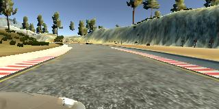

Behavioral Cloning Project
=====

The goal of this project is to create an AI that is capable of steering a computer simulated car by imitating human drivers.

Summary
-----
 * Used Keras to create a Convolutional Neural Network (CNN) that can produce a correct steering angle solely from camera input.
 * The CNN was trained to imitate human drivers.
 * The final CNN was capable of driving through the same course it was trained on indefinitely.

Project workflow
-----
1. Collect data.
1. Preprocess training data.
1. Select a convolutional neural network architecture.
1. Train the model.
1. Test and improve the model.

Collect training data
-----
Each sample of the training data contains the following items:

* Image from center camera (320 pixels x 160 pixels x RGB)
* Image from left camera (320 pixels x 160 pixels x RGB)
* Image from right camera (320 pixels x 160 pixels x RGB)
* Steering angle (in degrees)

Images from left and right cameras were used for training (and training only) as if they were from the center camera with an appropriate correction (0.35 degree) applied to the corresponding steering angle. The benefit of using them is two fold:

1. Increases the number of training samples.
1. Teaches the AI how to steer back to the center of the road.

The data sets I used for this project came from two sources:

1. [Sample training data](https://d17h27t6h515a5.cloudfront.net/topher/2016/December/584f6edd_data/data.zip) provided by Udacity
1. Samples I collected by driving the car on the simulator.

For #2, I generated two sets of driving data:

1. Smooth and continuous driving around the entire course for three to four laps.
1. Driving only a section of the course after the bridge, where the AI had trouble steering at first.

Below are sample input images:

| Left Camera   | Center Camera | Right Camera |
|---------|-------|-------|
|  || |

#### Sample Data Characteristics:
 * Number of samples: 55824 (80%/20% split for training/validation)
 * Three images from three cameras (left, center, right)
 * Image format and dimension: JPEG, 320x180x3 (W x H x RGB)
 * Steering angle (value range: [-25, 25 ])

Preprocess training data
-----

I removed 90% of samples whose steering angle is strictly zero to reduce AI's strong tendency to go straight. The *Test and Improve the model* section has more explanation on this topic.

Normalization and cropping are applied in the CNN itself.

Select a convolutional neural network model
-----
I took the CNN described in [Nvidia's website](https://devblogs.nvidia.com/parallelforall/deep-learning-self-driving-cars/) and added a layer at the beginning to remove top 70 lines and bottom 20 lines from an input image. Here is the description of the CNN model used in this project.

| Processing Layer      |  Description                                         | Output Dimension (WxHxD)
|:----------------------|:-----------------------------------------------------|:------------------------
| Input                 | RGB image                                            | 320x180x3
| Cropping              | Cropping (removing top 70 and bottom 20 lines)       | 230x180x3
| Normalization         | Normlize RGB image                                   | 230x180x3
| Convolutional         | Depth=24, kernel=5x5, stride=2x2, activation=RELU    | 113x88x24
| Convolutional         | Depth=36, kernel=5x5, stride=2x2, activation=RELU    | 55x42x36 
| Convolutional         | Depth=48, kernel=5x5, stride=2x2, activation=RELU    | 25x19x48
| Convolutional         | Depth=64, kernel=3x3, activation=RELU                | 23x17x64
| Convolutional         | Depth=64, kernel=3x3, activation=RELU                | 21x15x64
| Flatten               |                                                      | 20160
| Dropout               | Probability=50%                                      | 20160
| Fully connected       |                                                      | 100
| Fully connected       |                                                      | 43
| Fully connected       |                                                      | 10
| Fully connected       |                                                      | 1

I did not attempt to reduce over-fitting because during training both training and validation accuracies were close enough and also progressively improved over epochs.

Since the CNN is powerful enough to control a real car in the real world, it certainly must be powerful enough for this project but most likely not the simplest possible. I did not try other simpler models because of time constraints.

Train the model
-----
I applied the following preprocessing to the original data to prepare training and validation data for Keras' optimization function *fit_generator*.

1. Used 80% of the total for training only and 20% for validation only. No cross-validation was performed.
1. From the training set randomly removed 90% of all frames whose steering angle is strictly 0 to reduce AI's tendency to go straight. 
1. From each frame in the training set:
   1. Picked the image from the center camera and steering angle and add the pair to the final training set.
   1. Picked the image from the left camera and (steering angle + 0.35)  and add the pair to the final training set.
   1. Picked the image from the right camera and (steering angle - 0.35) and add the pair to the final training set.

I did not apply any other preprocessing to the training data. However, I added a cropping layer to the model itself.

There were 34752 samples in the final training set and 11166 samples in the validation set.

For training I used an Adam optimizer and thus did not need to adjust learning rates manually.

It took approximately 240 seconds per epoch to train the model with the K520 GPU. The model was trained over 5 epochs. Here is how training and validation accuracies improved over epochs.

| Epoch | Training Loss | Validation Loss |
|------:|------:|------:|
| 1     | 0.0288| 0.0098|
| 2     | 0.0088| 0.0069|
| 3     | 0.0080| 0.0099|
| 4     | 0.0076| 0.0079|
| 5     | 0.0072| 0.0077|

Test and improve the model
-----
The trained model was tested in the automatic mode of the car simulator. The automatic mode runs the following steps for each frame until the simulator is stopped:

1. The simulator feeds data from the center camera to the model.
1. The model produces a steering angle based on the camera data.
1. The simulator applies the steering to the car.

The first few models I created always went off the course at the sharp left curve after the bridge. Thinking it was caused by the lack of training data, I collected more data around that section of the course. I was hoping it would teach the AI how to make that section, but unfortunately it only slightly improved the outcome.  While the car looked more eager to steer left, it still failed to get past the section. 

I went back to the training data to examine it, and immediately realized many samples (23.4% of all samples) had strictly 0 steering angle. Thinking that was why the car had such a strong tendency to go straight, I removed 90% of them from the training data. The result was dramatic. Not only could the AI driven car successfully get past the curve, it could complete a full lap over and over again!
